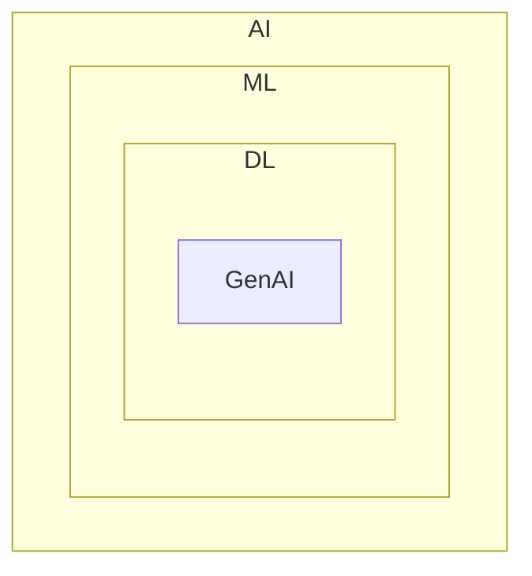

# Generative AI using LangChain

## What is GenAI ?
`
Genarative AI is a type of artificial intelligence that creates new content - such as text, images, music or code by learning patterns from existing data, mimicking human creativity. 
`

## Where is GenAI stand?

## GenAI impact areas!

- Customer Support
- Content Creation
- Software Development
- Education

## 