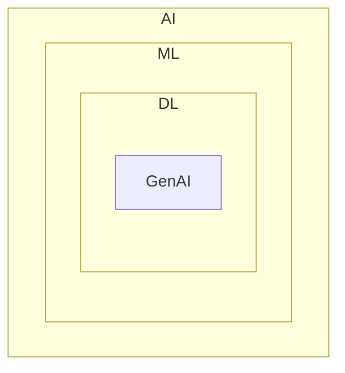
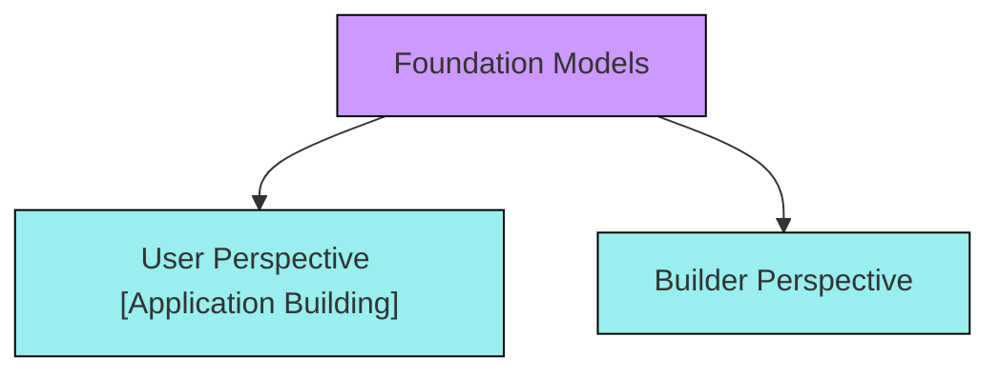

# Generative AI using LangChain

## What is GenAI ?
`
Genarative AI is a type of artificial intelligence that creates new content - such as text, images, music or code by learning patterns from existing data, mimicking human creativity. 
`

## Where is GenAI stand?

## GenAI impact areas!

- Customer Support
- Content Creation
- Software Development
- Education

## Mental model

## What is LangChain?

- LangChain is an open-source framework for developing applications powered by LLMs.

## LangChain benefits?

- Concepts of chains
- Model Agnostic Development
- Complete ecosystem
- Memory and state handling

## Components of LangChain

- Models
- Prompts
- Chains
- Memory
- Indexes
- Agents

## What are Models in LangChain & their types?

- Models are the core interfaces through which you interact with AI models.

 Two types of model :->

- Language Models  [LLMs, Chat Models (text -> text)]  
- Embedding Models [text -> Vector]

## What is Prompts ?

- Prompts are input provided to LLMs.

## What are Chains & it's types ?

## What are Indexes & it's types?

- Indexes connect your applications to external knowledge - such as PDFs,
websites or databases.

Types :- 

- Doc Loader
- Text Splitter
- Vector Store
- Retrievers